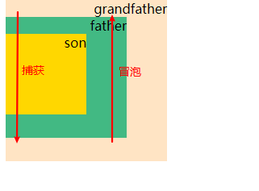

# js捕获、冒泡事件
  - ##在多层结构标签中,比如下方三层div里，如果每层div都设置了点击监听事件。当点击son时，捕获是从父节点走向子节点，而冒泡是从子节点上升到父节点  

		<body>
		
grandfather
		    
father
		        
son

		    

		

		</body>
		

  - ##js的addEventListener
    - js通过addEventListener方法监听dom事件，这方法有三个参数，第一个是事件类型（比如‘click’），第二个是事件触发后执行的函数，第三个是一个boolean，不写默认为false。当为false时是冒泡传递触发的，当为true是时捕获传递触发的。即fasle时（son->father->grandfather）,为true时（grandfather->father->son）  
    - 在js中，我们可以用stopPropagation()来阻止捕获冒泡事件。
     
    		son.addEventListener('click',function(e){
					e.stopPropagation();
					...
				})
    
    